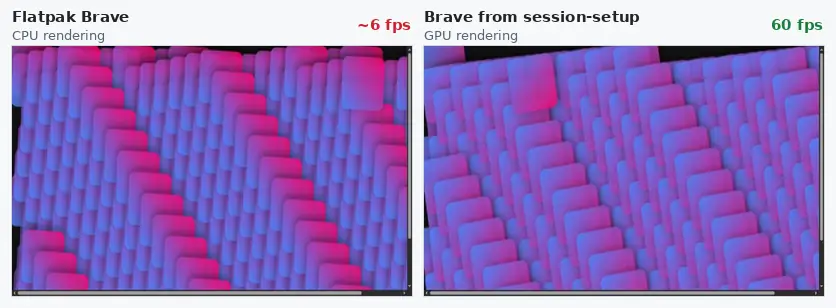
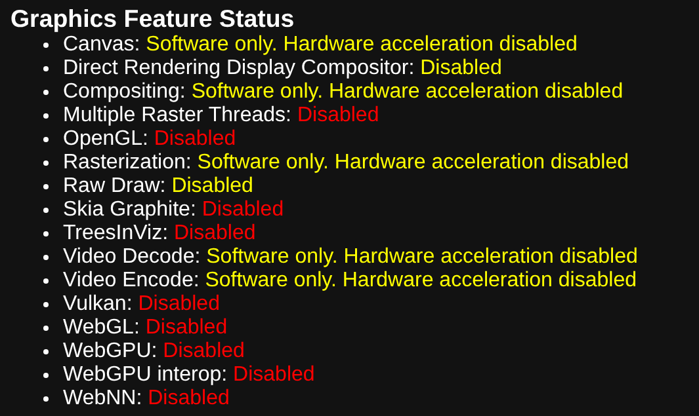
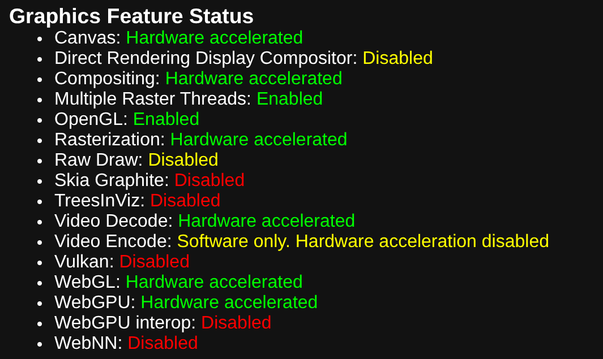
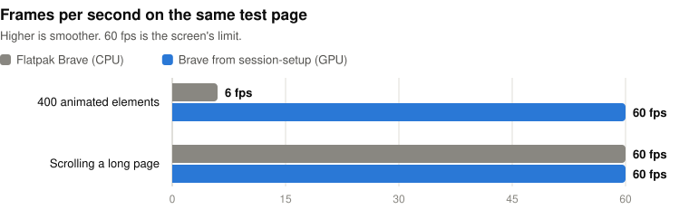
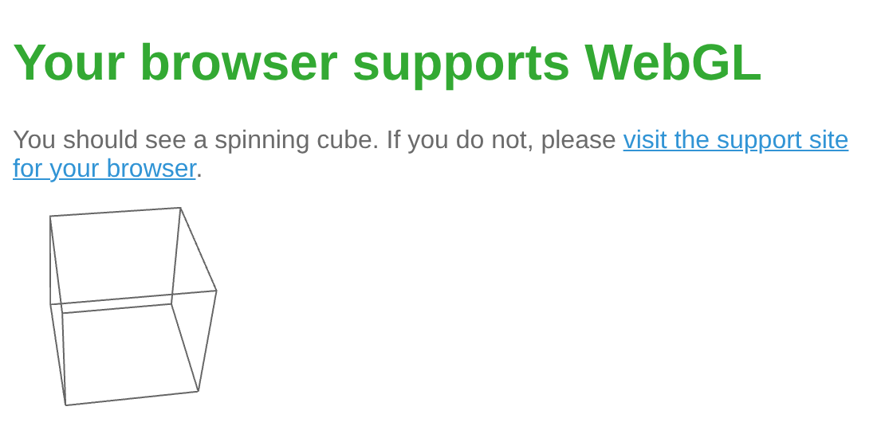
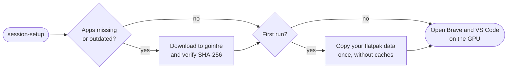
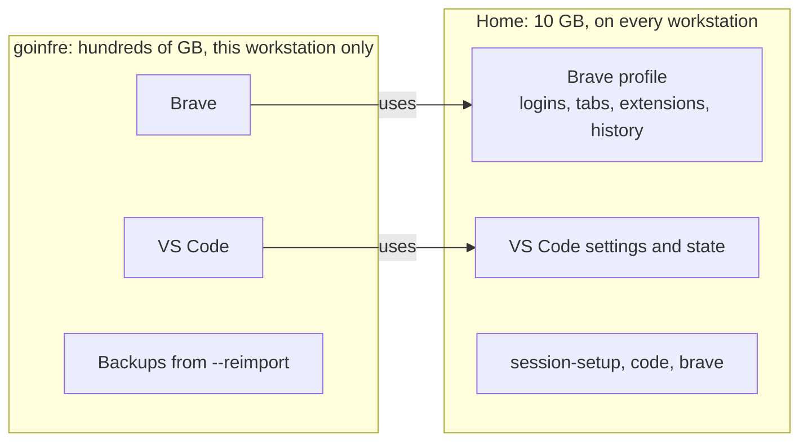

# session-setup

GPU-accelerated Brave and VS Code on 1337 / 42 workstations, set up in one command.

<p align="center">
  
  <br>
  <sub>The same test page, recorded in both browsers on a 1337 workstation.</sub>
</p>

session-setup installs the official Brave and VS Code builds in goinfre, moves your data over from the flatpak versions, and keeps everything working as you move from one workstation to another.

## Why

The 1337 workstations run Ubuntu 22.04 with kernel 5.15. Brave and VS Code are installed as flatpaks, and the flatpak runtime ships Mesa 26, which needs kernel 6.6 or newer. On these machines it can't use the GPU, so it falls back to software rendering (llvmpipe) and everything those apps draw goes through the 4 CPU cores, the same cores your compiler, containers and dev servers need.

You can see it in `brave://gpu`:

| Flatpak Brave | Brave from session-setup |
|---|---|
|  |  |

In practice that means:

- Animated or graphics-heavy pages stutter, and the browser competes with your work for CPU time
- WebGL is turned off, so Figma (which requires WebGL), 3D viewers and other WebGL sites don't work
- VS Code runs in a sandbox: its terminal can't see the tools installed on the system, so everything goes through `host-spawn`

The official Linux builds of Brave and VS Code use the system's own graphics drivers, which work with the GPU. They don't fit in the 10 GB home quota, so session-setup puts them in goinfre and keeps your data in your home.

### Before and after

Measured on a 1337 workstation (Intel i5-7500, AMD Radeon RX 470/580, 8 GB RAM), same test page in both browsers:

<picture>
  <source media="(prefers-color-scheme: dark)" srcset="docs/fps-dark.svg">
  
</picture>

| | Flatpak Brave | Brave from session-setup |
|---|---|---|
| Renderer | llvmpipe (CPU) | AMD Radeon (GPU) |
| WebGL, needed by Figma | Not available | Available |
| Page with 400 animated elements | 6 fps | 60 fps |
| CPU usage during that test | 34% | 32% |
| Scrolling a long page | 60 fps | 60 fps |

Ten times the frame rate for the same CPU usage (60 fps is the screen's limit). Plain scrolling was already smooth; the difference shows on anything animated or graphics-heavy, like design tools, 3D viewers and animated dashboards. With rendering on the GPU, the CPU stays free for your work.

WebGL, checked on [get.webgl.org](https://get.webgl.org):

| Flatpak Brave | Brave from session-setup |
|---|---|
|  |  |

### Setup time

| | Time |
|---|---|
| First run on a workstation (downloads Brave and VS Code) | about 35 seconds |
| Every run after that on the same workstation | about 2 seconds |

Your data is copied from the flatpak apps once, on your very first run.

## Features

- Installs the latest Brave and VS Code in goinfre, verifies their checksums and keeps them up to date
- Copies your flatpak Brave and VS Code data once: logins, saved passwords, bookmarks, open tabs, extensions, settings, history
- Keeps the large app files out of your home quota, and your data in your home where it follows you
- Adds `brave` and `code` commands and app menu entries, which install the apps by themselves on a workstation that doesn't have them yet
- Runs VS Code outside the flatpak sandbox, with a regular terminal and your nvm Node on the PATH
- Detects everything at runtime, so the same script works for anyone, on any workstation

## Installation

```sh
git clone https://github.com/shank187/session-setup.git
./session-setup/session-setup
```

The first run installs the script to `~/.local/bin` and adds that folder to your PATH, so afterwards `session-setup` works from any new terminal.

Close the flatpak Brave and VS Code before the first run so your data can be copied. If they're still open, the script tells you and you can simply run it again once they're closed.

## Usage

Run it at the start of every session:

```sh
session-setup
```

It makes sure Brave and VS Code are installed and up to date on the workstation you're on, then opens them.

Day to day, use "Brave (native)" and "VS Code (native)" from the app menu, or the `brave` and `code` commands. Pin them to the dock in place of the old flatpak entries.

### Options

| Command | What it does |
|---|---|
| `session-setup` | Install or update the apps, copy your data if needed, open both apps |
| `session-setup --prepare` | Same, without opening the apps |
| `session-setup --reimport [vscode\|brave]` | Copy the flatpak data again (your current data is backed up first) |
| `session-setup open vscode\|brave [args]` | Start one app, installing it first if needed (this is what `code`, `brave` and the app menu entries run) |

## How it works

What a run does:



### Storage

42 workstations give you two places to keep files, and session-setup uses each for what it's good at:



| | Home (`~`) | goinfre (`/goinfre/$USER`) |
|---|---|---|
| Size | 10 GB quota | Hundreds of GB |
| Where it's available | On every workstation you log into | Only on the workstation it's on |
| How long it lasts | Permanent | Can be cleaned at any time |
| What session-setup keeps there | The script, your Brave profile, your VS Code settings and state | Brave and VS Code themselves, downloaded extension packages, backups |

The apps are large (about 1.5 GB together) and can be downloaded again at any time, so they live in goinfre. Your data is what matters and has to follow you, so it stays in your home. Home is also the better place for it performance-wise: goinfre is a local hard drive, and it's noticeably slower than home at the many small writes a browser profile makes.

When you log into a workstation whose goinfre doesn't have the apps (a workstation you haven't used, or one whose goinfre was cleaned), the next `session-setup` run, or a click on one of the app entries, downloads them again. Nothing is lost, because your data was never in goinfre.

Exact locations:

| What | Where |
|---|---|
| Brave profile | `~/.config/BraveSoftware/Brave-Browser` |
| Brave cache (limited to 500 MB) | `~/.cache/BraveSoftware` |
| VS Code settings and state | `~/.config/Code` |
| VS Code extensions | Shared with the flatpak VS Code in `~/.var/app/com.visualstudio.code/data/vscode/extensions`, or `~/.vscode/extensions` if you never used the flatpak |
| Brave and VS Code | `/goinfre/$USER/apps` |
| Backups made by `--reimport` | `/goinfre/$USER/backups` |

### Data migration

- Done once per app, caches excluded. The flatpak data is never modified, so you can always go back.
- VS Code extensions are shared with the flatpak VS Code rather than copied, to save space.
- If you already have native Brave or VS Code data in `~/.config`, it is kept. `--reimport` replaces it and moves the previous data to goinfre.
- Configs that tools created from inside the flatpak terminal (git's global ignore file, for example) are copied to `~/.config` when you don't have them already.

### Detected at runtime

- goinfre: `/goinfre/$USER`, or `$GOINFRE` if you set it. Without a goinfre, the apps go to `~/.local/opt` and you get a warning, since that takes about 1.5 GB of your home.
- The flatpak (or snap) Brave and VS Code data, wherever it is in `~/.var/app`.
- The VS Code extensions folder in use.
- Node from nvm, wherever nvm is installed, so VS Code terminals don't fall back to the old system Node.

### Also

- Stops `gnome-software`, which uses around 300 MB of RAM in the background (it comes back at next login)
- Limits Brave's disk cache to 500 MB

## Requirements

A 1337 / 42 Linux workstation. Everything the script uses (bash, curl, unzip, tar, rsync, python3, flatpak) is already installed.

## Uninstall

```sh
rm ~/.local/bin/{session-setup,code,brave}
rm ~/.local/share/applications/{code,brave}-native.desktop
rm -r ~/.config/session-setup /goinfre/$USER/apps
```

Then remove the `# Added by session-setup` lines from your `.zshrc` or `.bashrc`. Your Brave and VS Code data in `~/.config/BraveSoftware` and `~/.config/Code` is left in place.

## License

[MIT](LICENSE)
